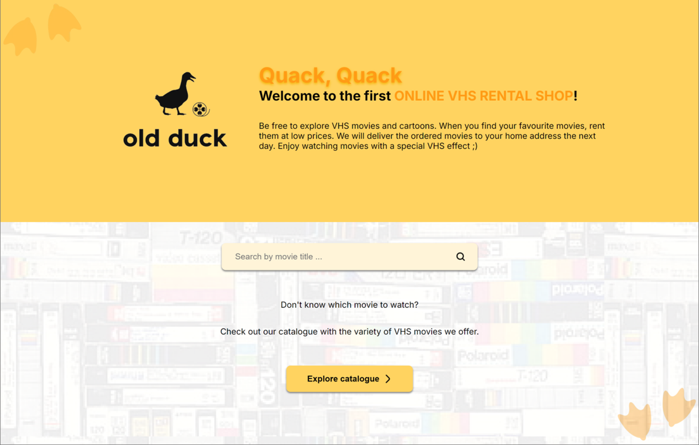
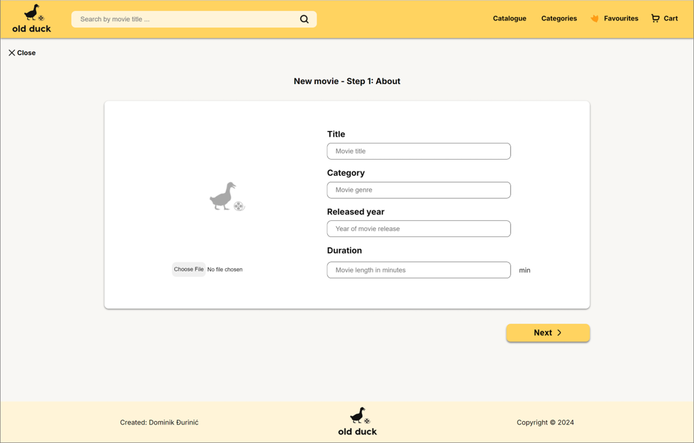

# Old Duck - VHS Rental Shop

Old Duck is a web application created as part of a project for applying for a front-end position at True North.

## Goal of a project

The goal of the project is to show knowledge, skills and creativity in the creation of web application user interfaces using the example of the VHS Rental Shop.

 
 

## About the application

The application is responsive and can be used on mobile and desktop devices.

The application displays several pages: Home Page, Catalogue Page, Details Page, Favorites Page, Add New Movie Page and Edit Movie Page.

In the application, it is possible to view all VHS movies from the database, view movie details, create a new movie and add it to the database, edit an existing movie, delete a movie and set or delete favorites.

 
 

## Technologies

The technologies used in the creation of the application are **Next.js**, **React** and **TypeScript**.

Figma was used in the design of the user interface ([Figma project - Old Duck](https://www.figma.com/design/PVE4leTmTi410m8adPMjGJ/Old-Duck---True-North?node-id=0-1&t=hSG708AQtZFB9xw7-1)).

 
 

## Screens

Below you can view some pages of Old Duck - VHS Store Applications:

### **1.Home Page**

 
 

### **2.Catalogue Page**

 
 

### **3.Details Page**

 
 

### **4.Add New Movie Page**

 
 

### **5.Edit Movie Page**

 
 

### **6.Favorites Page**

 

Created: Dominik Đurinić, august 2024., Zagreb
